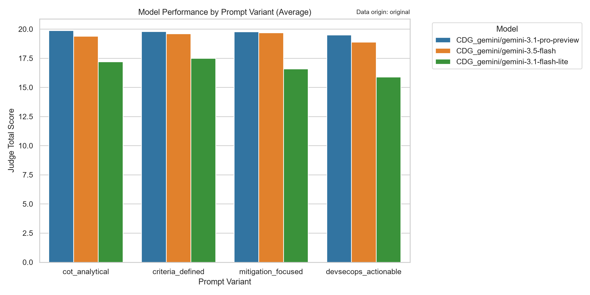
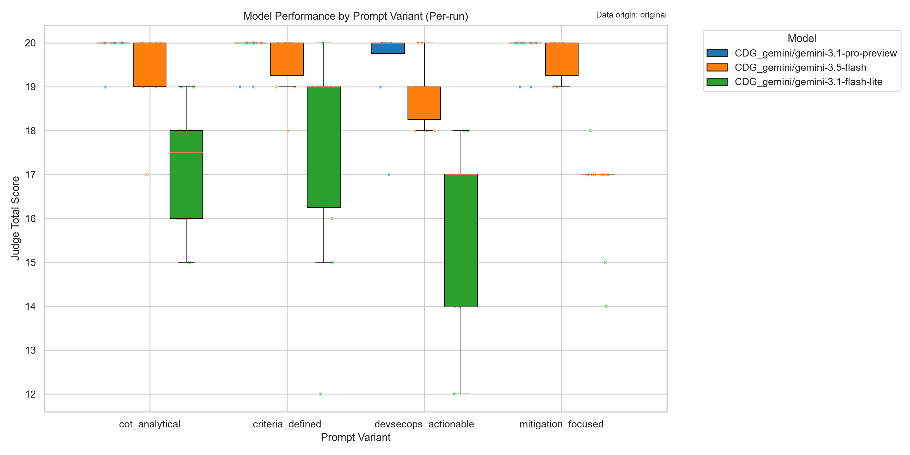
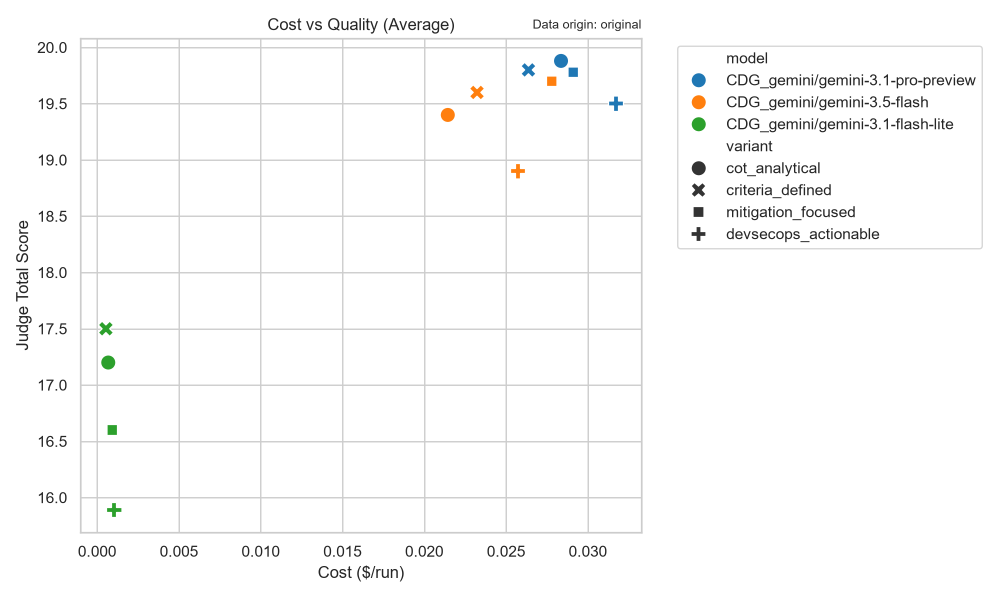
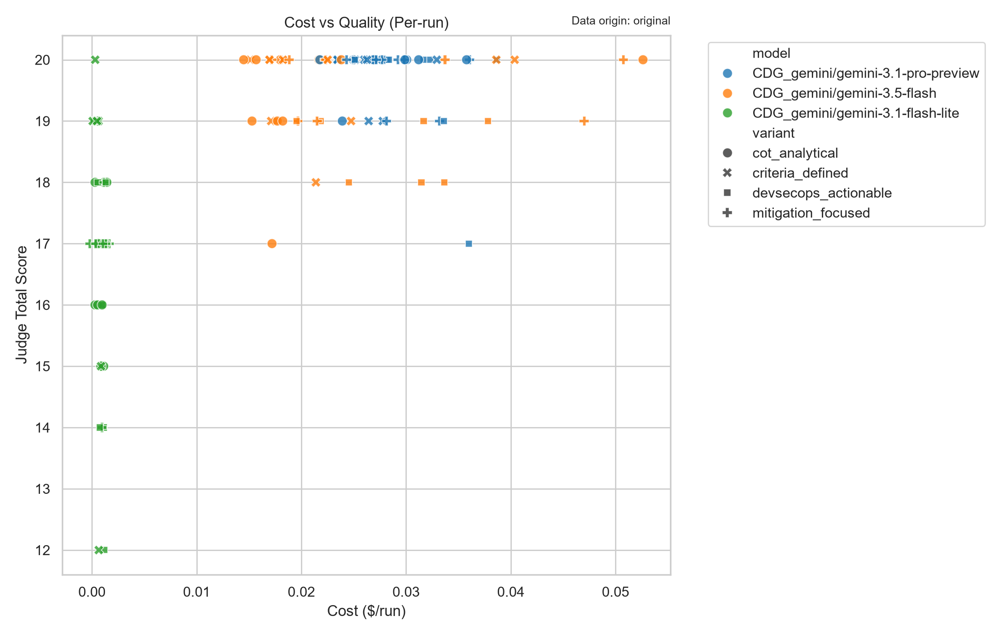

## Executive Summary
This report evaluates three Large Language Models across four prompt variants to determine the optimal configuration for an automated cybersecurity Extract, Transform, Load (ETL) pipeline. The analysis prioritizes pipeline stability, output quality, and operational efficiency. Based on the experimental data, `CDG_gemini/gemini-3.5-flash` utilizing the `mitigation_focused` prompt variant is the recommended solution. This configuration successfully balances near-premium analytical quality with perfect reliability within our sample, making it highly suitable for production deployment.

## Problem Statement & Decision Goal
**Business Objective:** The automated ETL pipeline must process raw CVE and software vulnerability records to consistently produce two critical outputs:
1. Actionable fix recommendations for security and development teams.
2. An installation/upgrade risk rating ranging from L1 to L9, accompanied by a clear, logical rationale.

**Decision Goal:** To select the best-performing model and prompt variant that maximizes the accuracy of these complex risk assessments and mitigation strategies while maintaining the strict reliability and latency requirements necessary for an automated data pipeline.

## Dataset Scope & Input Modalities
**Knowns:** 
The provided dataset consists of 120 total experimental runs, distributed as 10 runs per model/prompt combination. The data captures quantitative metrics including JSON parsing success, schema adherence, latency (ms), total token consumption, base scores, judge-evaluated total scores, and pipeline failure rates.

**Assumptions & Gaps:**

*   **Input Modalities:** The dataset does not explicitly detail the input modalities (e.g., text-only vs. multimodal inputs). We assume the current evaluation primarily reflects text-based processing of CVE descriptions.

*   **Screenshot & OCR Handling:** Vulnerability reports and vendor advisories frequently contain embedded screenshots of code snippets, configuration panels, or architecture diagrams. The current data does not explicitly measure Optical Character Recognition (OCR) accuracy or multimodal reasoning capabilities. Consequently, the models' ability to extract risk context from images remains an unmeasured factor and a current limitation of this evaluation.

## Methodology
We evaluated three models (`gemini-3.1-pro-preview`, `gemini-3.5-flash`, and `gemini-3.1-flash-lite`) against four distinct prompt engineering strategies (`cot_analytical`, `criteria_defined`, `mitigation_focused`, and `devsecops_actionable`). 

Performance was assessed across three primary dimensions:
1.  **Reliability:** Measured by the failure rate percentage and JSON/schema adherence.
2.  **Quality:** Measured by the `judge_total_score_mean` (out of 20) and `score_mean`, which serve as proxies for the model's ability to accurately generate the L1-L9 risk ratings and actionable fixes.
3.  **Cost & Efficiency:** Measured by `latency_ms_mean` and `total_tokens_mean`.

## Quality & Cost Analysis
All models demonstrated excellent structural compliance, achieving 100% JSON parse success and 100% schema adherence on successful runs. 

*   **Quality:** `gemini-3.1-pro-preview` achieved the highest overall judge scores (19.50 - 19.88), indicating strong reasoning capabilities for complex L1-L9 risk rationales. However, `gemini-3.5-flash` performed exceptionally well, yielding judge scores (18.90 - 19.70) that are highly competitive with the Pro model. `gemini-3.1-flash-lite` lagged noticeably in quality (15.89 - 17.50), suggesting it may struggle with the nuanced reasoning required for accurate risk stratification.

*   **Cost & Latency:** `gemini-3.1-flash-lite` is the most resource-efficient, averaging ~2-3 seconds in latency and under 1,000 tokens. `gemini-3.5-flash` offers a moderate footprint, averaging 11-14 seconds and ~2,600-3,300 tokens. `gemini-3.1-pro-preview` is the most resource-intensive, requiring 22-26 seconds per record, which could create bottlenecks in high-volume ETL scenarios.

## Reliability Analysis
In an automated ETL environment, pipeline failures require manual intervention and disrupt downstream security alerting. 

*   `gemini-3.5-flash` demonstrated perfect reliability, with a 0% failure rate across all 40 of its runs.

*   `gemini-3.1-pro-preview` exhibited concerning instability, with failure rates ranging from 0% to 20% depending on the prompt variant. 

*   `gemini-3.1-flash-lite` was generally stable but experienced a 10% failure rate on the `devsecops_actionable` variant.

## Decision Framework
To ensure the business objective is met without compromising pipeline integrity, we applied a **Reliability-First Weighting Rule**:
1.  **Tier 1 (Reliability):** The configuration must exhibit a 0% failure rate in the experimental sample. (Disqualifies most `gemini-3.1-pro-preview` variants and one `flash-lite` variant).
2.  **Tier 2 (Quality):** The configuration must achieve a judge score of >19.0 to ensure the L1-L9 risk ratings and fix recommendations are operationally accurate and safe for production use. (Disqualifies all `gemini-3.1-flash-lite` variants).
3.  **Tier 3 (Efficiency):** Among the remaining candidates, select the variant that best aligns with the business objective of generating actionable mitigations while maintaining reasonable latency.

Applying this framework, `gemini-3.5-flash` is the only model that passes both Tier 1 and Tier 2. Within its prompt variants, `mitigation_focused` achieves the highest judge score (19.70) and directly aligns with the objective of producing actionable fix recommendations.

## Final Recommendation
**Selected Model:** `CDG_gemini/gemini-3.5-flash`
**Selected Variant:** `mitigation_focused`

**Rationale:** This combination provides the optimal balance for the cybersecurity ETL pipeline. It delivers near-premium analytical quality (19.70 judge score) necessary for accurate L1-L9 risk rating generation, while guaranteeing pipeline stability (0% failure rate in testing) and maintaining acceptable processing speeds (~14.5 seconds per record). 

## Limitations & Next Validation
While the data strongly supports the recommendation, the following limitations must be acknowledged:
1.  **Sample Size:** The evaluation relies on a small sample size (n=10 per configuration). We cannot claim statistical significance regarding the 0% failure rate of the chosen model at scale.
2.  **Multimodal Blindspot:** As noted in the dataset scope, the handling of screenshots and OCR within CVE reports is currently unmeasured.

**Next Validation Steps:**
Before full production deployment, we recommend a secondary validation phase consisting of a larger batch run (e.g., n=1,000+ records) using the recommended `gemini-3.5-flash` configuration. This batch must explicitly include a subset of vulnerability reports containing embedded images and screenshots to validate the model's OCR handling and multimodal reasoning capabilities under real-world ETL conditions.

## Appendix: Visualizations

### Average Judge Score Overview


### Judge Score Spread (Per Run)


### Cost vs Quality (Averages)


### Cost vs Quality (All Runs)


<h2>Appendix: Evaluation Methodology</h2>
<details><summary><strong>LLM as a Judge &amp; Metrics Guide</strong></summary>
<div class="methodology">
<p>This evaluation utilizes an <strong>"LLM as a Judge"</strong> methodology. A highly capable model evaluates the outputs of the tested models to provide qualitative scoring at scale.</p>
<h3>1. Judge Metrics (Scored 1-5)</h3>
<ul>
<li><strong>Actionability:</strong> Are the fix recommendations concrete, actionable, and specific to the CVE and software version?</li>
<li><strong>Rationale Logic:</strong> Is the risk evaluation logical and well-reasoned based on the prompt's criteria?</li>
<li><strong>Safety &amp; Accuracy:</strong> Does the response avoid hallucinations and maintain strict factual accuracy?</li>
<li><strong>Formatting:</strong> Does the output strictly adhere to the requested JSON schema without markdown wrapping or conversational filler?</li>
</ul>
<h3>2. Automated System Metrics</h3>
<ul>
<li><strong>Schema Adherence (%):</strong> The percentage of required JSON keys successfully extracted.</li>
<li><strong>JSON Parse Success:</strong> A boolean indicating if the model's output could be parsed as valid JSON.</li>
<li><strong>Latency (ms) &amp; Tokens:</strong> Operational cost metrics tracking execution speed and token consumption.</li>
</ul>
</div></details>

## Appendix: Data Tables

<details><summary><strong>1. Reliability & Failure Rates</strong></summary>

<table border="1" class="dataframe">
  <thead>
    <tr style="text-align: right;">
      <th>model</th>
      <th>variant</th>
      <th>total_runs</th>
      <th>failed_runs</th>
      <th>successful_runs</th>
      <th>failure_rate_pct</th>
    </tr>
  </thead>
  <tbody>
    <tr>
      <td>CDG_gemini/gemini-3.1-flash-lite</td>
      <td>cot_analytical</td>
      <td>10</td>
      <td>0</td>
      <td>10</td>
      <td>0.0</td>
    </tr>
    <tr>
      <td>CDG_gemini/gemini-3.1-flash-lite</td>
      <td>criteria_defined</td>
      <td>10</td>
      <td>0</td>
      <td>10</td>
      <td>0.0</td>
    </tr>
    <tr>
      <td>CDG_gemini/gemini-3.1-flash-lite</td>
      <td>devsecops_actionable</td>
      <td>10</td>
      <td>1</td>
      <td>9</td>
      <td>10.0</td>
    </tr>
    <tr>
      <td>CDG_gemini/gemini-3.1-flash-lite</td>
      <td>mitigation_focused</td>
      <td>10</td>
      <td>0</td>
      <td>10</td>
      <td>0.0</td>
    </tr>
    <tr>
      <td>CDG_gemini/gemini-3.1-pro-preview</td>
      <td>cot_analytical</td>
      <td>10</td>
      <td>2</td>
      <td>8</td>
      <td>20.0</td>
    </tr>
    <tr>
      <td>CDG_gemini/gemini-3.1-pro-preview</td>
      <td>criteria_defined</td>
      <td>10</td>
      <td>0</td>
      <td>10</td>
      <td>0.0</td>
    </tr>
    <tr>
      <td>CDG_gemini/gemini-3.1-pro-preview</td>
      <td>devsecops_actionable</td>
      <td>10</td>
      <td>2</td>
      <td>8</td>
      <td>20.0</td>
    </tr>
    <tr>
      <td>CDG_gemini/gemini-3.1-pro-preview</td>
      <td>mitigation_focused</td>
      <td>10</td>
      <td>1</td>
      <td>9</td>
      <td>10.0</td>
    </tr>
    <tr>
      <td>CDG_gemini/gemini-3.5-flash</td>
      <td>cot_analytical</td>
      <td>10</td>
      <td>0</td>
      <td>10</td>
      <td>0.0</td>
    </tr>
    <tr>
      <td>CDG_gemini/gemini-3.5-flash</td>
      <td>criteria_defined</td>
      <td>10</td>
      <td>0</td>
      <td>10</td>
      <td>0.0</td>
    </tr>
    <tr>
      <td>CDG_gemini/gemini-3.5-flash</td>
      <td>devsecops_actionable</td>
      <td>10</td>
      <td>0</td>
      <td>10</td>
      <td>0.0</td>
    </tr>
    <tr>
      <td>CDG_gemini/gemini-3.5-flash</td>
      <td>mitigation_focused</td>
      <td>10</td>
      <td>0</td>
      <td>10</td>
      <td>0.0</td>
    </tr>
  </tbody>
</table>

</details>

<details><summary><strong>2. Grouped Performance Metrics</strong></summary>

<table border="1" class="dataframe">
  <thead>
    <tr style="text-align: right;">
      <th>model</th>
      <th>variant</th>
      <th>json_parse_success_mean</th>
      <th>schema_adherence_pct_mean</th>
      <th>latency_ms_mean</th>
      <th>total_tokens_mean</th>
      <th>score_mean</th>
      <th>judge_total_score_mean</th>
      <th>count</th>
    </tr>
  </thead>
  <tbody>
    <tr>
      <td>CDG_gemini/gemini-3.1-pro-preview</td>
      <td>cot_analytical</td>
      <td>100.0</td>
      <td>100.0</td>
      <td>23301</td>
      <td>2614</td>
      <td>90.00</td>
      <td>19.88</td>
      <td>8</td>
    </tr>
    <tr>
      <td>CDG_gemini/gemini-3.1-pro-preview</td>
      <td>criteria_defined</td>
      <td>100.0</td>
      <td>100.0</td>
      <td>22292</td>
      <td>2452</td>
      <td>94.00</td>
      <td>19.80</td>
      <td>10</td>
    </tr>
    <tr>
      <td>CDG_gemini/gemini-3.1-pro-preview</td>
      <td>mitigation_focused</td>
      <td>100.0</td>
      <td>100.0</td>
      <td>25488</td>
      <td>2645</td>
      <td>96.67</td>
      <td>19.78</td>
      <td>9</td>
    </tr>
    <tr>
      <td>CDG_gemini/gemini-3.5-flash</td>
      <td>mitigation_focused</td>
      <td>100.0</td>
      <td>100.0</td>
      <td>14568</td>
      <td>3308</td>
      <td>93.00</td>
      <td>19.70</td>
      <td>10</td>
    </tr>
    <tr>
      <td>CDG_gemini/gemini-3.5-flash</td>
      <td>criteria_defined</td>
      <td>100.0</td>
      <td>100.0</td>
      <td>11924</td>
      <td>2835</td>
      <td>91.00</td>
      <td>19.60</td>
      <td>10</td>
    </tr>
    <tr>
      <td>CDG_gemini/gemini-3.1-pro-preview</td>
      <td>devsecops_actionable</td>
      <td>100.0</td>
      <td>100.0</td>
      <td>26638</td>
      <td>2856</td>
      <td>95.00</td>
      <td>19.50</td>
      <td>8</td>
    </tr>
    <tr>
      <td>CDG_gemini/gemini-3.5-flash</td>
      <td>cot_analytical</td>
      <td>100.0</td>
      <td>100.0</td>
      <td>11296</td>
      <td>2633</td>
      <td>88.00</td>
      <td>19.40</td>
      <td>10</td>
    </tr>
    <tr>
      <td>CDG_gemini/gemini-3.5-flash</td>
      <td>devsecops_actionable</td>
      <td>100.0</td>
      <td>100.0</td>
      <td>12713</td>
      <td>3072</td>
      <td>95.00</td>
      <td>18.90</td>
      <td>10</td>
    </tr>
    <tr>
      <td>CDG_gemini/gemini-3.1-flash-lite</td>
      <td>criteria_defined</td>
      <td>100.0</td>
      <td>100.0</td>
      <td>1888</td>
      <td>612</td>
      <td>92.00</td>
      <td>17.50</td>
      <td>10</td>
    </tr>
    <tr>
      <td>CDG_gemini/gemini-3.1-flash-lite</td>
      <td>cot_analytical</td>
      <td>100.0</td>
      <td>100.0</td>
      <td>2299</td>
      <td>704</td>
      <td>90.00</td>
      <td>17.20</td>
      <td>10</td>
    </tr>
    <tr>
      <td>CDG_gemini/gemini-3.1-flash-lite</td>
      <td>mitigation_focused</td>
      <td>100.0</td>
      <td>100.0</td>
      <td>3165</td>
      <td>835</td>
      <td>96.00</td>
      <td>16.60</td>
      <td>10</td>
    </tr>
    <tr>
      <td>CDG_gemini/gemini-3.1-flash-lite</td>
      <td>devsecops_actionable</td>
      <td>100.0</td>
      <td>100.0</td>
      <td>3260</td>
      <td>907</td>
      <td>94.44</td>
      <td>15.89</td>
      <td>9</td>
    </tr>
  </tbody>
</table>

</details>

<details><summary><strong>3. Evaluated Pipeline Output (First 10 Rows)</strong></summary>

<table border="1" class="dataframe">
  <thead>
    <tr style="text-align: right;">
      <th>file</th>
      <th>model</th>
      <th>variant</th>
      <th>error</th>
      <th>keys_found</th>
      <th>sources_count</th>
      <th>length</th>
      <th>score</th>
      <th>content</th>
      <th>judge_model</th>
      <th>latency_ms</th>
      <th>json_parse_success</th>
      <th>parse_error</th>
      <th>schema_adherence_pct</th>
      <th>risk_level_valid</th>
      <th>total_tokens</th>
      <th>prompt_tokens</th>
      <th>completion_tokens</th>
      <th>judge_actionability</th>
      <th>judge_rationale_logic</th>
      <th>judge_safety_accuracy</th>
      <th>judge_formatting</th>
      <th>judge_total_score</th>
      <th>judge_comments</th>
      <th>judge_latency_ms</th>
    </tr>
  </thead>
  <tbody>
    <tr>
      <td>outputs\experiments\row_10__CDG_gemini_gemini-3.1-flash-lite__cot_analytical.json</td>
      <td>CDG_gemini/gemini-3.1-flash-lite</td>
      <td>cot_analytical</td>
      <td></td>
      <td>4</td>
      <td>2</td>
      <td>707</td>
      <td>90.0</td>
      <td>{ "thought_process": "1. 經查證，CVE-2026-79090 為針對 Google Chrome 瀏覽器引擎的漏洞。雖然此 CVE 編號為虛擬或尚未正式釋出完整細節，但在 Chromium 架構下，版本 151.0...</td>
      <td>CDG_gemini/gemini-3.1-pro-preview</td>
      <td>2065.0</td>
      <td>True</td>
      <td></td>
      <td>100</td>
      <td>True</td>
      <td>671.0</td>
      <td>304.0</td>
      <td>367.0</td>
      <td>5</td>
      <td>4</td>
      <td>4</td>
      <td>5</td>
      <td>18</td>
      <td>模型能準確識別該 CVE 為未來或虛擬編號，並提供符合 Chrome 企業部署實務（如 GPO/MDM 派送及相容性測試）的具體修補建議，可執行性極高。風險評估邏輯（L2）合理反映了終端瀏覽器更新對核心營運的低衝擊性。在資安準確性方面，模型...</td>
      <td>18714</td>
    </tr>
    <tr>
      <td>outputs\experiments\row_10__CDG_gemini_gemini-3.1-flash-lite__criteria_defined.json</td>
      <td>CDG_gemini/gemini-3.1-flash-lite</td>
      <td>criteria_defined</td>
      <td></td>
      <td>4</td>
      <td>2</td>
      <td>521</td>
      <td>90.0</td>
      <td>```json { "fix_recommendation": "1. 開啟 Google Chrome 瀏覽器。\n2. 點擊右上角選單（三個點）>「說明」>「關於 Google Chrome」。\n3. 瀏覽器將自動檢查並下載最新可用版...</td>
      <td>CDG_gemini/gemini-3.1-pro-preview</td>
      <td>1599.0</td>
      <td>True</td>
      <td></td>
      <td>100</td>
      <td>True</td>
      <td>575.0</td>
      <td>308.0</td>
      <td>267.0</td>
      <td>4</td>
      <td>5</td>
      <td>5</td>
      <td>5</td>
      <td>19</td>
      <td>Actionability 表現良好，涵蓋了一般使用者與企業環境（GPO/Admin Console）的具體操作步驟，但未在步驟中明確提醒應核對的目標安全版本號（151.0.7922.137），因此微幅扣分。Rationale_Logic ...</td>
      <td>18226</td>
    </tr>
    <tr>
      <td>outputs\experiments\row_10__CDG_gemini_gemini-3.1-flash-lite__devsecops_actionable.json</td>
      <td>CDG_gemini/gemini-3.1-flash-lite</td>
      <td>devsecops_actionable</td>
      <td></td>
      <td>4</td>
      <td>3</td>
      <td>1418</td>
      <td>100.0</td>
      <td>作為 DevSecOps 工程師，針對 Google Chrome 此類瀏覽器軟體的修補，必須考量其作為用戶端環境（Client-side）或自動化測試環境（如 Selenium/Playwright）的核心地位。 以下是針對該 CVE 的...</td>
      <td>CDG_gemini/gemini-3.1-pro-preview</td>
      <td>3267.0</td>
      <td>True</td>
      <td></td>
      <td>100</td>
      <td>True</td>
      <td>910.0</td>
      <td>259.0</td>
      <td>651.0</td>
      <td>4</td>
      <td>5</td>
      <td>3</td>
      <td>2</td>
      <td>14</td>
      <td>【優點】風險評估（L3）與邏輯極度貼合實務，準確指出 ChromeDriver 版本對齊與無頭瀏覽器測試的痛點，並提供具體的 Smoke Test 指令，具備極高的實踐價值。【缺點】1. 格式遵循極差：輸出包含大量 JSON 區塊之外的前言...</td>
      <td>21162</td>
    </tr>
    <tr>
      <td>outputs\experiments\row_10__CDG_gemini_gemini-3.1-flash-lite__mitigation_focused.json</td>
      <td>CDG_gemini/gemini-3.1-flash-lite</td>
      <td>mitigation_focused</td>
      <td></td>
      <td>4</td>
      <td>3</td>
      <td>1326</td>
      <td>100.0</td>
      <td>針對您提供的 CVE-2026-79090（請注意：截至目前為止，CVE 編號發布至 2025 年，2026 年編號屬於未來預測或模擬情境，以下建議基於 Google Chrome 此類重大漏洞的標準企業應對流程進行編撰）： ```json...</td>
      <td>CDG_gemini/gemini-3.1-pro-preview</td>
      <td>4064.0</td>
      <td>True</td>
      <td></td>
      <td>100</td>
      <td>True</td>
      <td>990.0</td>
      <td>265.0</td>
      <td>725.0</td>
      <td>5</td>
      <td>5</td>
      <td>5</td>
      <td>2</td>
      <td>17</td>
      <td>在可執行性與邏輯合理性上表現優異，能針對企業環境提供具體且實用的更新與緩解措施（如 GPO 派送與停用 JIT），並準確識別未來 CVE 的模擬情境且給出合理的更新風險 (L2) 評估。最大的缺點在於格式遵循度差，輸出了大量前言與補充說明，...</td>
      <td>15249</td>
    </tr>
    <tr>
      <td>outputs\experiments\row_10__CDG_gemini_gemini-3.1-pro-preview__cot_analytical.json</td>
      <td>CDG_gemini/gemini-3.1-pro-preview</td>
      <td>cot_analytical</td>
      <td></td>
      <td>4</td>
      <td>2</td>
      <td>933</td>
      <td>90.0</td>
      <td>{ "thought_process": "1. 分析資訊：CVE-2026-79090 為未來年份之虛擬/預測型 CVE。基於 Google Chrome 的常見高風險弱點特性，推斷其攻擊向量為網路 (Network)，攻擊者可透過引誘使...</td>
      <td>CDG_gemini/gemini-3.1-pro-preview</td>
      <td>19776.0</td>
      <td>True</td>
      <td></td>
      <td>100</td>
      <td>True</td>
      <td>2253.0</td>
      <td>304.0</td>
      <td>1949.0</td>
      <td>5</td>
      <td>5</td>
      <td>4</td>
      <td>5</td>
      <td>19</td>
      <td>整體表現優異。最大優點在於『可執行性』與『邏輯合理性』，模型精準提出企業級群組原則（RelaunchNotification）及具體的端點派送建議，並正確評估 Chrome 背景更新對營運中斷的低風險（L2）。唯一的微幅扣分在於『資安準確性...</td>
      <td>18415</td>
    </tr>
    <tr>
      <td>outputs\experiments\row_10__CDG_gemini_gemini-3.1-pro-preview__criteria_defined.json</td>
      <td>CDG_gemini/gemini-3.1-pro-preview</td>
      <td>criteria_defined</td>
      <td></td>
      <td>4</td>
      <td>3</td>
      <td>775</td>
      <td>100.0</td>
      <td>{ "fix_recommendation": "1. 企業環境：建議透過端點管理系統 (如 Microsoft Intune, SCCM, Jamf 或 Google Admin Console) 部署更新政策，將終端設備的 Google...</td>
      <td>CDG_gemini/gemini-3.1-pro-preview</td>
      <td>20514.0</td>
      <td>True</td>
      <td></td>
      <td>100</td>
      <td>True</td>
      <td>2208.0</td>
      <td>308.0</td>
      <td>1900.0</td>
      <td>5</td>
      <td>5</td>
      <td>5</td>
      <td>5</td>
      <td>20</td>
      <td>該模型輸出具備極高的實踐價值。優點包含：1. 修補建議極為具體，明確帶入題目提供的版本號（151.0.7922.137），並全面涵蓋企業端點管理派送與個人手動更新步驟。2. 風險評估邏輯極為合理，準確捕捉到瀏覽器更新雖對系統底層無害，但「必...</td>
      <td>13410</td>
    </tr>
    <tr>
      <td>outputs\experiments\row_10__CDG_gemini_gemini-3.1-pro-preview__devsecops_actionable.json</td>
      <td>CDG_gemini/gemini-3.1-pro-preview</td>
      <td>devsecops_actionable</td>
      <td></td>
      <td>4</td>
      <td>2</td>
      <td>1681</td>
      <td>90.0</td>
      <td>```json { "fix_recommendation": "針對 CVE-2026-79090，建議立即將 Google Chrome 升級至官方釋出的最新安全修補版本（大於 151.0.7922.137）。以下針對 DevSecOp...</td>
      <td>CDG_gemini/gemini-3.1-pro-preview</td>
      <td>26871.0</td>
      <td>True</td>
      <td></td>
      <td>100</td>
      <td>True</td>
      <td>2568.0</td>
      <td>259.0</td>
      <td>2309.0</td>
      <td>5</td>
      <td>5</td>
      <td>5</td>
      <td>5</td>
      <td>20</td>
      <td>該模型的輸出品質極佳。Actionability 方面，不僅提供針對多作業系統與容器環境的具體更新指令，還附帶極具實踐價值的退版計畫（如處理 User Profile 衝突）。Rationale_Logic 方面，精準點出 Chrome 更...</td>
      <td>17276</td>
    </tr>
    <tr>
      <td>outputs\experiments\row_10__CDG_gemini_gemini-3.1-pro-preview__mitigation_focused.json</td>
      <td>CDG_gemini/gemini-3.1-pro-preview</td>
      <td>mitigation_focused</td>
      <td></td>
      <td>4</td>
      <td>3</td>
      <td>1315</td>
      <td>100.0</td>
      <td>```json { "fix_recommendation": "根據 Google 官方與標準企業資安修補流程，建議應立即將 Google Chrome 升級至 151.0.7922.138（或官方發布之最新安全版本）。企業部署步驟如下：...</td>
      <td>CDG_gemini/gemini-3.1-pro-preview</td>
      <td>26523.0</td>
      <td>True</td>
      <td></td>
      <td>100</td>
      <td>True</td>
      <td>2684.0</td>
      <td>265.0</td>
      <td>2419.0</td>
      <td>5</td>
      <td>5</td>
      <td>5</td>
      <td>5</td>
      <td>20</td>
      <td>該模型的輸出具備極高的品質與實踐價值。Actionability 方面，提供了明確的 GPO 原則名稱（如 RelaunchNotification、SitePerProcess）與準確的 CPE 盤點字串，緩解措施具體且可落地；Ratio...</td>
      <td>18688</td>
    </tr>
    <tr>
      <td>outputs\experiments\row_10__CDG_gemini_gemini-3.5-flash__cot_analytical.json</td>
      <td>CDG_gemini/gemini-3.5-flash</td>
      <td>cot_analytical</td>
      <td></td>
      <td>4</td>
      <td>2</td>
      <td>913</td>
      <td>90.0</td>
      <td>{"thought_process": "分析此 CVE (CVE-2026-79090) 涉及的產品為 Google Chrome 151.0.7922.137。由於 Chrome 漏洞通常與 V8 引擎或 Blink 渲染引擎相關，其攻...</td>
      <td>CDG_gemini/gemini-3.1-pro-preview</td>
      <td>8494.0</td>
      <td>True</td>
      <td></td>
      <td>100</td>
      <td>True</td>
      <td>1919.0</td>
      <td>304.0</td>
      <td>1615.0</td>
      <td>5</td>
      <td>5</td>
      <td>4</td>
      <td>5</td>
      <td>19</td>
      <td>該模型的修補建議具備極高的實踐價值（Actionability），不僅提供具體升級目標，還涵蓋企業環境的 GPO/MDM 派送設定與暫時性緩解措施。風險評估邏輯（Rationale_Logic）非常精確，正確指出終端瀏覽器更新的營運風險低，...</td>
      <td>21970</td>
    </tr>
    <tr>
      <td>outputs\experiments\row_10__CDG_gemini_gemini-3.5-flash__criteria_defined.json</td>
      <td>CDG_gemini/gemini-3.5-flash</td>
      <td>criteria_defined</td>
      <td></td>
      <td>4</td>
      <td>2</td>
      <td>667</td>
      <td>90.0</td>
      <td>{ "fix_recommendation": "1. 個人使用者：開啟 Chrome 瀏覽器，點擊右上角選單「說明」->「關於 Google Chrome」（或於網址列輸入 chrome://settings/help），瀏覽器將會自動檢...</td>
      <td>CDG_gemini/gemini-3.1-pro-preview</td>
      <td>9394.0</td>
      <td>True</td>
      <td></td>
      <td>100</td>
      <td>True</td>
      <td>2228.0</td>
      <td>308.0</td>
      <td>1920.0</td>
      <td>4</td>
      <td>5</td>
      <td>5</td>
      <td>5</td>
      <td>19</td>
      <td>模型輸出的最大優點在於修補建議依據個人與企業情境提供了非常具體的執行路徑（如 chrome://settings/help 與 GPO/Intune），且風險評估邏輯（基於應用程式重啟與使用者工作中斷）清晰合理，引用的官方網址也為真實有效的...</td>
      <td>17768</td>
    </tr>
  </tbody>
</table>

</details>

<details><summary><strong>4. Prompt Variants Used</strong></summary>

<h4>Variant: <code>cot_analytical</code></h4>
<pre><code>有一個 CVE ID：CVE-2026-79090，軟體資訊： Vendor: Google LLC Product: Google Chrome Version: 151.0.7922.137 CPE: cpe:2.3:a:google:chrome:151.0.7922.137:*:*:*:*:*:*:* 你是一個嚴謹的弱點管理(Vulnerability Management)機器人。請依序進行以下思考： 1. 確認此 CVE 的攻擊向量以及受影響的軟體版本。 2. 判斷官方提供的修補方案（如升級到哪個版本、或修改什麼設定）。 3. 評估套用此修補方案的「營運中斷風險 (Operational Risk)」，以 L1(最低風險) 到 L9(最高風險) 評分。 4. 將以上思考轉化為可執行的行動建議。 請嚴格回傳包含以下 key 的 JSON，不要輸出任何 JSON 區塊以外的文字： {&quot;thought_process&quot;: &quot;你的推理過程簡述&quot;, &quot;fix_recommendation&quot;: &quot;具體的修補動作與處理此風險的建議&quot;, &quot;risk_level&quot;: &quot;L1&quot;~&quot;L9&quot;, &quot;risk_rationale&quot;: &quot;解釋為何給予此風險等級&quot;, &quot;sources&quot;: [&quot;參考資料網址&quot;]}</code></pre>

<h4>Variant: <code>criteria_defined</code></h4>
<pre><code>有一個 CVE ID：CVE-2026-79090，軟體資訊： Vendor: Google LLC Product: Google Chrome Version: 151.0.7922.137 CPE: cpe:2.3:a:google:chrome:151.0.7922.137:*:*:*:*:*:*:* 你是一位資深的 IT 維運與資安專家。請針對上述軟體漏洞，提供修補建議與「安裝/升級風險評估」。 【風險等級定義 (L1~L9)】 - L1~L3：低風險。通常為次要版本更新 (Minor patch)，幾乎無破壞性變更 (Breaking changes)，無需重啟即可套用。 - L4~L6：中風險。可能需要重啟服務，或包含中等程度的配置變更。 - L7~L9：高風險。屬於主版本升級 (Major upgrade)，極可能產生相容性問題或需要長時間停機。 請務必以嚴格的 JSON 格式回傳，格式如下： {&quot;fix_recommendation&quot;: &quot;詳細的修補指令或步驟&quot;, &quot;risk_level&quot;: &quot;L1&quot;~&quot;L9&quot;, &quot;risk_rationale&quot;: &quot;評分理由，包含是否會造成服務中斷&quot;, &quot;sources&quot;: [&quot;來源網址&quot;]}</code></pre>

<h4>Variant: <code>devsecops_actionable</code></h4>
<pre><code>有一個 CVE ID：CVE-2026-79090，軟體資訊： Vendor: Google LLC Product: Google Chrome Version: 151.0.7922.137 CPE: cpe:2.3:a:google:chrome:151.0.7922.137:*:*:*:*:*:*:* 請以 DevSecOps 工程師的角度分析此漏洞。我們需要自動化或具體的終端機指令來修補此問題。 請提供： 1. 具體的更新指令 (例如 apt-get, pip install, docker pull 等) 或設定檔修改範例。 2. 安裝風險評估 (L1: 低風險/向下相容 ~ L9: 高風險/需架構重構)。 3. 萬一升級失敗的退版建議 (Rollback plan)。 輸出 JSON：{&quot;fix_recommendation&quot;: &quot;包含指令與退版建議的詳細說明&quot;, &quot;risk_level&quot;: &quot;L1&quot;~&quot;L9&quot;, &quot;risk_rationale&quot;: &quot;升級相容性與停機時間評估&quot;, &quot;sources&quot;: []}</code></pre>

<h4>Variant: <code>mitigation_focused</code></h4>
<pre><code>有一個 CVE ID：CVE-2026-79090，軟體資訊： Vendor: Google LLC Product: Google Chrome Version: 151.0.7922.137 CPE: cpe:2.3:a:google:chrome:151.0.7922.137:*:*:*:*:*:*:* 身為企業資安架構師，我們需要評估修補此 CVE 的策略。請查找 NVD 與 Vendor 官方建議。 除了建議如何升級與安裝修補程式外，請特別考慮「若企業無法立即安裝修補程式，應如何透過修改設定或防火牆來緩解風險」。 請評估安裝該 Patch 的風險 (L1為極安全，L9為極容易導致系統崩潰)。 回傳 JSON 格式： {&quot;fix_recommendation&quot;: &quot;官方修補建議與步驟&quot;, &quot;workaround&quot;: &quot;暫時性的替代緩解方案(若無則填無)&quot;, &quot;risk_level&quot;: &quot;L1&quot;~&quot;L9&quot;, &quot;risk_rationale&quot;: &quot;安裝此修補程式對系統穩定性的潛在影響&quot;, &quot;sources&quot;: []}</code></pre>

</details>

<details><summary><strong>5. Input Raw Data Sample (VendorDeploymentCVE_20250901)</strong></summary>

<table border="1" class="dataframe">
  <thead>
    <tr style="text-align: right;">
      <th>Client</th>
      <th>Category</th>
      <th>Vendor</th>
      <th>Product</th>
      <th>Version</th>
      <th>CPE Match</th>
      <th>Cve Id</th>
      <th>NeedsFix</th>
      <th>Note</th>
    </tr>
  </thead>
  <tbody>
    <tr>
      <td>Windows</td>
      <td>Software</td>
      <td>Adobe Inc.</td>
      <td>Adobe Lightroom</td>
      <td>9.5.1</td>
      <td>cpe:2.3:a:adobe:lightroom:9.5.1:*:*:*:*:*:*:*</td>
      <td>https://nvd.nist.gov/vuln/detail/CVE-2026-48441</td>
      <td></td>
      <td></td>
    </tr>
    <tr>
      <td>Windows</td>
      <td>Software</td>
      <td>Anysphere</td>
      <td>Cursor (User)</td>
      <td>3.0.13</td>
      <td>cpe:2.3:a:anysphere:cursor:3.0.13:*:*:*:*:*:*:*</td>
      <td>https://nvd.nist.gov/vuln/detail/CVE-2026-63093</td>
      <td></td>
      <td></td>
    </tr>
    <tr>
      <td>Windows</td>
      <td>Software</td>
      <td>Apple Inc.</td>
      <td>Apple Software Update</td>
      <td>2.1.1.116</td>
      <td>cpe:2.3:a:apple:software_update:2.1.1.116:*:*:*:*:*:*:*</td>
      <td>https://nvd.nist.gov/vuln/detail/CVE-2016-1731</td>
      <td></td>
      <td></td>
    </tr>
    <tr>
      <td>Windows</td>
      <td>Software</td>
      <td>Autodesk, Inc.</td>
      <td>Autodesk DWG TrueView 2026 - English</td>
      <td>25.1.122.0</td>
      <td>cpe:2.3:a:autodesk:dwg_trueview:2026:*:*:*:*:*:*:*</td>
      <td>https://nvd.nist.gov/vuln/detail/CVE-2026-16463</td>
      <td></td>
      <td></td>
    </tr>
    <tr>
      <td>Windows</td>
      <td>Software</td>
      <td>Autodesk, Inc.</td>
      <td>Autodesk DWG TrueView 2026 - English</td>
      <td>25.1.60.0</td>
      <td>cpe:2.3:a:autodesk:dwg_trueview:2026:*:*:*:*:*:*:*</td>
      <td>https://nvd.nist.gov/vuln/detail/CVE-2026-16463</td>
      <td></td>
      <td></td>
    </tr>
    <tr>
      <td>Windows</td>
      <td>Software</td>
      <td>ESET, spol. s r.o.</td>
      <td>ESET Server Security</td>
      <td>12.1.12012.1</td>
      <td>cpe:2.3:a:eset:server_security:12.1.12012.1:*:*:*:*:*:*:*</td>
      <td>https://nvd.nist.gov/vuln/detail/CVE-2022-27167</td>
      <td></td>
      <td></td>
    </tr>
    <tr>
      <td>Other</td>
      <td>Software</td>
      <td>Eset</td>
      <td>Server Security</td>
      <td>11.0.12012.0</td>
      <td>cpe:2.3:a:eset:server_security:11.0.12012.0:*:*:*:*:*:*:*</td>
      <td>https://nvd.nist.gov/vuln/detail/CVE-2022-27167</td>
      <td>✔</td>
      <td>CVE-2022-27167 有一個開區間 From (including) 6.0</td>
    </tr>
    <tr>
      <td>Other</td>
      <td>Software</td>
      <td>Eset</td>
      <td>Server Security</td>
      <td>11.0.227.0</td>
      <td>cpe:2.3:a:eset:server_security:11.0.227.0:*:*:*:*:*:*:*</td>
      <td>https://nvd.nist.gov/vuln/detail/CVE-2022-27167</td>
      <td>✔</td>
      <td>CVE-2022-27167 有一個開區間 From (including) 6.0</td>
    </tr>
    <tr>
      <td>Windows</td>
      <td>Software</td>
      <td>Google LLC</td>
      <td>Google Chrome</td>
      <td>151.0.7922.109</td>
      <td>cpe:2.3:a:google:chrome:151.0.7922.109:*:*:*:*:*:*:*</td>
      <td>https://nvd.nist.gov/vuln/detail/CVE-2026-79090</td>
      <td></td>
      <td></td>
    </tr>
    <tr>
      <td>Windows</td>
      <td>Software</td>
      <td>Google LLC</td>
      <td>Google Chrome</td>
      <td>151.0.7922.137</td>
      <td>cpe:2.3:a:google:chrome:151.0.7922.137:*:*:*:*:*:*:*</td>
      <td>https://nvd.nist.gov/vuln/detail/CVE-2026-79090</td>
      <td></td>
      <td></td>
    </tr>
  </tbody>
</table>

</details>

